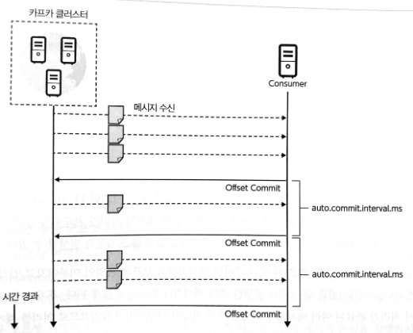

Kafka는 **이벤트를 토픽에 저장하고, 소비자가 자기 읽기 위치에서 가져가는 시스템**이다. 

`프로듀서 → 토픽(파티션) → 컨슈머`

이미지 출처: [IBM Cloud Docs — Apache Kafka 개요](https://cloud.ibm.com/docs/EventStreams?topic=EventStreams-apache_kafka)
## 1. 이벤트(메시지)

**무슨 일이 일어났는지** 나타내는 데이터. ==**레코드**==라고도 부른다.
ex) `주문 123이 생성됐다`. 

- **키**: 관련 이벤트를 같은 파티션에 보내는 기준. ex) 주문 ID `123`.
	- ==**동일 메시지 키 -> 동일 파티션에 적재**==
	- 파티션 개수가 변경되면 메시지 키와 파티션 매칭이 달라질 순 있다.
	- 선언하지 않으면 `null`로 설정 -> 기본 설정 파티셔너에 따라 파티션에 분배된다
- **값**: 실제 내용. ex) `{ "orderId": 123, "status": "CREATED" }`.
- **타임스탬프**: 이벤트가 생성된 시각
- **헤더**: 이벤트 부가정보
	- 키-값 형태로 추가하며, 보통 스키마 버전 등을 저장하여 컨슈머에서 참조
- **오프셋**: 0 이상의 숫자로 이루어지며, 카프카 컨슈머가 데이터를 가져갈 때 사용
	- 직접 지정 불가하고, 브로커에 저장될 때 파티션 안에서 부여된다.

==**한 번 적재된 이벤트는 수정 불가**==하다. 삭제만 가능하다.
## 2. 프로듀서와 토픽

- **프로듀서**: 이벤트를 보내는 프로그램. ex) 주문 서비스가 `주문 생성` 이벤트를 보낸다.
- **토픽**: ==**같은 종류의 이벤트를 모으는 이름**==. ex) `orders`. 
	- 토픽은 1개 이상의 `파티션`을 소유하고, 그 ==**이벤트는 파티션에 저장**==된다.

## 3. 브로커와 파티션

- **브로커**: 프로듀서로부터 받은 이벤트를 저장하고 컨슈머에게 제공하는 Kafka 서버. 여러 브로커가 모이면 클러스터다.
- **파티션**: 토픽을 나눈 저장·처리 단위.
	- 각 파티션에 이벤트가 순서대로 쌓인다. ==**순서는 같은 파티션 안에서만 보장**==된다.
		- ex) 같은 주문의 이벤트를 순서대로 처리하려면 주문 ID를 **키**로 보내 같은 파티션에 배치한다.
	- 파티션은 카프카의 ==**병렬처리의 핵심**==으로써 **그룹으로 묶인 컨슈머들이 레코드를 병렬로 처리할 수 있도록 매칭**된다.
- **복제**: 파티션을 ==**여러 브로커에 복사해 장애에 대비**==한다. 
	- 리더 파티션이 쓰기·읽기를 맡고 팔로워 파티션이 복제한다.
	- 리더에 장애가 나면 팔로워가 리더를 이어받을 수 있다.
	- 복제 개수의 최솟값은 1(복제없음)이고, 최댓값은 브로커 개수만큼 설정하여 사용 가능하다.

## 4. 컨슈머와 컨슈머 그룹

- **컨슈머**: 토픽에서 이벤트를 읽고 처리하는 프로그램.
- **컨슈머 그룹**: 함께 일을 나눠 하는 컨슈머들의 묶음. 서로 다른 컨슈머 그룹과는 격리된다.
	- **한 그룹 안에서 파티션 하나는 한 컨슈머가 읽는다**. 따라서 ==**한 토픽의 병렬 소비는 파티션 수를 넘지 않는다**==.
	- **서로 다른 그룹**은 같은 토픽을 각각 읽는다. ex) 결제 그룹과 알림 그룹이 `orders` 토픽을 독립적으로 소비한다.
	- `컨슈머 그룹의 컨슈머 개수 <= 토픽의 파티션 개수` 를 유지해야 한다. 컨슈머 개수가 더 커버리면 파티션을 할당받지 못하고 유휴 상태로 남게된다.
- **리밸런싱**: 그룹에 컨슈머가 들어오거나 나가면, 그룹 내에서 파티션 담당자를 다시 정한다.
	- 리밸런싱은 컨슈머가 데이터를 처리하는 도중에 언제든지 발생할 수 있다. 데이터 처리 중 발생한 리밸런싱에 대응하는 코드를 작성해야 한다.
	- 리밸런싱이 발생할 때마다, 컨슈머 재할당 과정에서 해당 ==**컨슈머 그룹의 다른 컨슈머들이 토픽을 읽을 수 없게 잠깐 멈춘다**== -> 지연 유발
	- 리밸런싱은 가용성을 높여주지만, 자주 발생해서는 안된다.

## 5. 오프셋과 보관 기간

- **오프셋**: 파티션 안에서 이벤트의 위치. 컨슈머 그룹은 어디까지 읽었는지 이 위치로 추적한다.
	- 그룹별·파티션별 읽기 위치는 `__consumer_offsets` 토픽에 저장된다.
- **오프셋 커밋**: 컨슈머가 재시작할 때 이어 읽을 위치를 Kafka에 저장한다.
	- **자동 커밋**: 기본 설정(`enable.auto.commit=true`)으로, ==**주기적으로(`auto.commit.interval.ms`) 읽기 위치를 자동 저장**==한다. 간단하지만, 이벤트를 읽은 직후 리밸런싱 또는 컨슈머 강제 종료 발생 시, 컨슈머가 처리하는 데이터가 중복 또는 유실될 수 있다.
	- **명시적 커밋**: 애플리케이션이 처리 시점에 맞춰 ==**직접 저장**==한다. 보통 레코드 처리가 끝난 뒤 커밋해 **유실 위험을 줄인다**. 처리 완료 후 커밋 전에 장애가 나면 같은 레코드를 다시 받을 수 있다.
	- 두 방식 모두 외부 DB 작업과 오프셋 커밋이 하나의 원자 작업은 아니다. 따라서 중복에도 안전한 처리가 필요하다.
- **컨슈머 랙(lag)**: 그룹이 읽은 위치와 로그 끝의 차이. ==**커지면 소비가 생산을 따라가지 못한다는 신호**==다.
- 이벤트는 읽었다고 바로 삭제되지 않는다. **보관 기간 안**이라면 읽기 위치를 옮겨 다시 처리할 수 있다.
