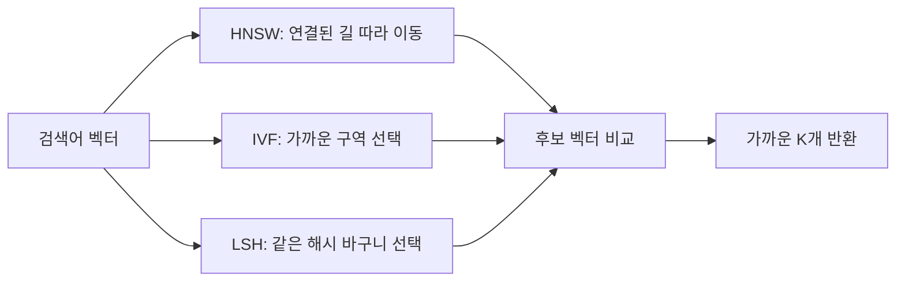
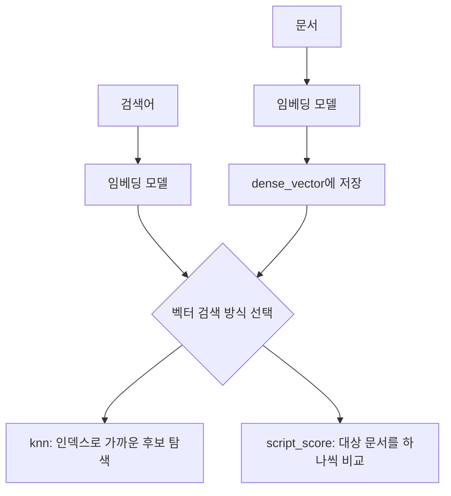

관련 개념: [[임베딩]].

## 왜 키워드 검색 대신 벡터 검색을 사용하나?

| 키워드 검색                             | 벡터 검색                               |
| ---------------------------------- | ----------------------------------- |
| "노트북" 검색 → 분석된 토큰 중심으로 검색          | "노트북" 검색 → "랩탑", "laptop"도 검색될 수 있음 |
| 토큰 일치와 BM25 점수 중심                  | 임베딩의 의미적 유사성 중심                     |
| 동의어 못잡음 -> 동의어 사전·분석기 설정 필요        | 유사어 검색 품질은 임베딩 모델에 의존               |
| 오타에 취약 -> fuzzy query 등으로 오타 대응 가능 | 오타·다국어 대응도 모델에 의존                   |

## KNN(K-Nearest Neighbors) 검색

- KNN 검색 = **==쿼리 벡터와 가장 가까운 K개의 벡터==를 찾는 알고리즘**
- **ANN(Approximate Nearest Neighbor)** = 정확한 KNN 대신 근사 검색으로 가까운 벡터 탐색
	- 정확도를 일부 양보해 검색 속도 향상. (개선 폭은 데이터·설정에 따라 달라짐)

### ANN 알고리즘: 가까운 후보를 어떻게 줄이나?

세 방식 모두 **전체 벡터를 비교하는 대신, 가까울 가능성이 높은 후보부터 탐색**


#### HNSW (Hierarchical Navigable Small World)

**HNSW** = 가까운 벡터끼리 연결한 **여러 층의 그래프**.

- **방식**: 위층의 큼지막한 연결로 크게 이동 → 아래층의 촘촘한 연결로 가까운 후보 탐색
- **장점**: 
	- ==**빠른 응답과 높은 재현율**==을 함께 노리기 좋음
	- IVF처럼 군집 중심을 미리 학습할 필요 없음
- **단점**: 
	- 벡터 외에 ==**연결 정보도 저장**== → ==**메모리 부담**==
	- 그래프 생성·문서 추가에 비용 발생
	- ==**탐색을 적게 하면 가까운 벡터를 놓칠 수 있음**==

>[HNSW 원 논문](https://arxiv.org/abs/1603.09320), [Elastic 8.19 — 벡터 인덱스](https://www.elastic.co/guide/en/elasticsearch/reference/8.19/dense-vector.html)

#### IVF (Inverted File Index)

**IVF** = 벡터를 **군집(비슷한 벡터의 묶음)** 으로 나누고, 각 군집에 속한 벡터 목록 저장.

- **방식**: 데이터로 군집 중심 학습 → 각 벡터를 가까운 군집에 배치 → 검색어와 가까운 몇 개 군집 안에서 비교
	- ex) 도서관 전체 대신 관련 서가 몇 곳만 탐색
- **장점**: 
	- 검색할 군집 수로 속도·재현율 조절 가능
	- **PQ(벡터 압축)** 와 결합하면 대규모 데이터의 메모리 절감에 유리
- **단점**: 
	- 대표 데이터로 군집 학습 필요
	- 선택하지 않은 군집의 가까운 벡터는 놓침
	- 데이터 분포가 크게 바뀌면 재학습·재색인 검토 필요

- **IVF 자체가 벡터 압축은 아님**. `IVF-Flat`은 원본 벡터 저장, `IVF-PQ`는 압축 벡터 저장. 
- Faiss의 `nprobe`는 검색할 군집 수 → 늘리면 재현율 개선 가능, 검색 비용 증가. [Faiss — IVF·압축 방식](https://github.com/facebookresearch/faiss/wiki/Faiss-indexes)

#### LSH (Locality Sensitive Hashing)

**LSH** = 가까운 데이터가 **같은 해시값을 얻을 확률이 높도록** 설계한 해시 방식.

- **방식**: 여러 해시 테이블에 벡터 저장 → 검색어도 해시 계산 → 같은 바구니의 후보를 모아 비교. ex) 비슷한 특징의 물건이 같은 바구니에 담기도록 여러 번 분류.
- **장점**: 
	- 전통적인 데이터 비의존 LSH는 군집 학습 불필요
	- 해시값으로 후보를 빠르게 모을 수 있음
- **단점**: 
	- 가까워도 다른 바구니에 들어가면 놓침
	- 재현율을 높이려 테이블을 늘리면 메모리·검색 비용 증가
	- 거리 기준에 맞는 해시 함수 선택 필요

**일반 해시와 목적이 다름**: 일반 해시는 충돌을 줄이고, ==**LSH는 비슷한 데이터의 충돌을 활용**==. [LSH 원 논문](https://www.cs.princeton.edu/courses/archive/spring13/cos598C/Gionis.pdf)

### 무엇을 기준으로 선택하나?

| 조건                                   | 먼저 고려      | 확인할 비용             |
| ------------------------------------ | ---------- | ------------------ |
| 빠른 응답·높은 재현율 필요, 메모리 여유 있음           | **HNSW**   | 그래프 메모리·색인 시간      |
| 대규모 데이터, 메모리 예산이 핵심                  | **IVF-PQ** | 군집 학습·압축에 따른 품질 손실 |
| 특정 거리 기준에 맞는 해시가 있고, 해시 기반 후보 수집이 적합 | **LSH**    | 필요한 테이블 수·후보 누락    |
| 데이터 또는 필터 적용 후 대상이 적고, 누락 없이 비교 필요   | **정확 KNN** | 대상 증가에 따른 검색 시간    |

비교 기준은 **재현율·응답 시간·메모리**, 운영 기준은 **색인 시간·추가/삭제 빈도·데이터 분포 변화**. 문서 수만으로 선택하지 않음. [Meta Engineering — 검색 성능 평가](https://engineering.fb.com/2017/03/29/data-infrastructure/faiss-a-library-for-efficient-similarity-search/)

ex) 동일한 벡터·거리 기준으로 정확 검색의 상위 10개를 구함 → ANN이 그중 9개를 찾으면 **Recall@10 = 90%**. 여러 실제 검색어에서 평균 재현율, 응답 시간(p95: 요청의 95%가 끝나는 시간), 메모리 사용량 비교. **ANN 재현율이 높아도 임베딩 모델이 부적합하면 의미 검색 품질은 낮을 수 있음**.

> [!note] Elasticsearch에서는 무엇을 선택하나?
> 이 노트의 **Elasticsearch 8.19 기준**, 기본 `float` 벡터 인덱스는 HNSW 기반 `int8_hnsw`. **IVF·LSH를 기본 `knn`의 설정으로 교체하는 구조는 아님**.
> 먼저 HNSW 기반 `knn`으로 시작 → `num_candidates`를 조절하며 재현율·응답 시간 측정. **메모리가 부족하면 양자화(벡터 값을 압축해 표현) 검토**. **IVF·LSH는 해당 방식을 지원하는 검색 엔진·라이브러리 선택 시 비교**.
> [Elastic 8.19 — 지원 인덱스](https://www.elastic.co/guide/en/elasticsearch/reference/8.19/dense-vector.html)

### 유사도 측정 방식

Elasticsearch KNN은 기본적으로 **==코사인 유사도(Cosine Similarity)==** 를 사용

```
코사인 유사도 = (A · B) / (||A|| × ||B||)

A = [0.5, 0.3, 0.2]
B = [0.4, 0.4, 0.1]

A · B = (0.5×0.4) + (0.3×0.4) + (0.2×0.1) = 0.34
||A|| = √(0.5² + 0.3² + 0.2²) = 0.616
||B|| = √(0.4² + 0.4² + 0.1²) = 0.574

코사인 유사도 = 0.34 / (0.616 × 0.574) = 0.96 (매우 유사!)
```

|유사도 값|의미|
|---|---|
|1.0|완전히 동일한 방향 (매우 유사)|
|0.0|직교 (관련 없음)|
|-1.0|정반대 방향 (반대 의미)|
### KNN 검색 흐름

```
┌────────────────────────────────────────────────┐
│  상품 A: [0.44, -0.21, 0.65, ...] → 유사도: 0.98  │
│  상품 B: [0.12, 0.45, -0.33, ...] → 유사도: 0.23  │
│  상품 C: [0.43, -0.25, 0.64, ...] → 유사도: 0.95  │
│  상품 D: [0.41, -0.20, 0.68, ...] → 유사도: 0.97  │
└────────────────────────────────────────────────┘
```

1. 쿼리: "게이밍 노트북 추천해줘"
2. 쿼리 임베딩: `[0.45, -0.23, 0.67, ...]`
3. 쿼리 임베딩 벡터를 포함하여 KNN 검색 수행 by Elasticsearch
4. 상위 K개 반환 (k=3일 때) → `상품 A (0.98), 상품 D (0.97), 상품 C (0.95)`

## 전체 흐름 이해하기

벡터 검색은 ==**저장 → 검색**== 두 단계로 나뉨.

1. **저장할 때**: 문서를 벡터로 변환 → Elasticsearch에 저장.
2. **검색할 때**: 검색어를 벡터로 변환 → 저장된 벡터 중 가까운 것 찾기.

ex) `"게이밍 노트북"`의 벡터를 미리 저장. 나중에 `"게임용 랩탑"`의 벡터와 비교해 검색.

여기서 각 개념의 역할은 다음과 같음.

- **임베딩 모델**: 텍스트를 벡터로 바꾸는 역할.
- **`dense_vector`**: 변환된 벡터를 저장하는 Elasticsearch 필드 타입.
- **`knn` / `script_score`**: 저장된 벡터를 검색하는 **서로 다른 방식**. 둘 중 하나 선택.



## 1. 문서를 벡터로 '저장'하기

먼저 벡터를 담을 필드 정의. **매핑(mapping)** = 필드 이름과 타입을 정하는 설정.

아래는 **Elasticsearch 8.19 기준** 예제. 이해를 위해 **3차원 가상 벡터** 사용.

```http
PUT vector-products
{
  "mappings": {
    "properties": {
      "title": { "type": "text" },
      "category": { "type": "keyword" },
      "embedding": {
        "type": "dense_vector",
        "dims": 3,
        "index": true,
        "similarity": "cosine"
      }
    }
  }
}
```

- `dense_vector`: `[0.44, -0.21, 0.65]` 같은 숫자 배열 저장.
- `dims: 3`: 차원 크기. ==**실제 모델의 출력 차원과 맞춰야 함**==.
- `index: true`: 빠른 검색을 위한 ==**벡터 인덱스 생성**==.
- `similarity: cosine`: 벡터가 얼마나 비슷한지 코사인 유사도로 판단.

다음으로 문서를 임베딩 모델에 넣고, **모델이 반환한 벡터를 원문과 함께 저장**. 이 저장 작업을 **색인(indexing)** 이라고 부름.

```http
PUT vector-products/_doc/1?refresh=wait_for
{
  "title": "게이밍 노트북",
  "category": "laptop",
  "embedding": [0.44, -0.21, 0.65]
}
```

==**`dense_vector`가 임베딩을 생성하는 것은 아님**==. 위 방식에서는 미리 애플리케이션에서 임베딩 모델을 호출해 벡터를 만든 뒤 그 결과만을 Elasticsearch에 저장.

> [!note] 문서와 검색어는 같은 기준으로 임베딩
> 같은 모델·버전 사용. 모델이 문서용·검색어용 입력 규칙을 구분하면 각각 따름.
> 숫자 개수만 같다고 서로 다른 모델의 벡터를 비교할 수 있는 것은 아님.

## 2. 저장된 벡터 '검색'하기: 두 방식 중 선택

검색어도 먼저 벡터로 변환. ex) `"게임용 랩탑" → [0.45, -0.23, 0.67]`.

이 벡터와 가까운 문서를 찾는 방법은 두 가지.

| 방식                        | 어떻게 찾나?                     | 장점                  | 단점                     |
| ------------------------- | --------------------------- | ------------------- | ---------------------- |
| **`knn`: 근사 검색**          | 인덱스로 가까운 후보를 찾아 비교          | 문서가 많아도 빠르게 검색 가능   | 실제로 가장 가까운 문서를 놓칠 수 있음 |
| **`script_score`: 정확 검색** | 검색 대상 문서를 하나씩 ==**전부 비교**== | 대상 안에서 실제 최근접 문서 찾기 | 대상이 많으면 느려짐            |

여기서 **정확**은 벡터 거리 기준. 사용자가 원하는 정답을 반드시 찾는다는 뜻은 아님.

### A. `knn`: 가까운 후보를 찾아 빠르게 검색

**HNSW** = 가까운 벡터끼리 연결해 둔 검색용 구조. 연결을 따라가며 가까운 후보 탐색 → 모든 문서를 비교하는 비용 절약.

Elasticsearch 8.19에서는 기본 벡터 인덱스가 HNSW 기반. ==**HNSW는 검색을 돕는 인덱스, `knn`은 이를 이용하는 검색 요청**==.

```http
POST vector-products/_search
{
  "size": 5,
  "_source": ["title", "category"],
  "knn": {
    "field": "embedding",
    "query_vector": [0.45, -0.23, 0.67],
    "k": 5,
    "num_candidates": 100,
    "filter": { "term": { "category": "laptop" } }
  }
}
```

읽는 방법: **노트북 카테고리 안에서, 검색어 벡터와 가까운 문서 최대 5개 찾기**. 예제는 1개만 저장했으므로 결과도 1개.

- `field`: 비교할 벡터 필드.
- `query_vector`: 검색어 벡터.
- `k`: 찾을 최근접 문서 수.
- `num_candidates`: 후보 수. 크게 잡으면 놓치는 문서가 줄어들 수 있지만 검색 비용 증가.
- `size`: 응답으로 받을 문서 수. 여기서는 `k`와 동일하게 설정.
- `filter`: 검색할 문서의 조건.

> [!note] 후보 수와 필터
> - `num_candidates`는 **샤드별** 후보 수. 샤드 = 데이터를 나눠 저장한 단위.
> - 각 샤드가 찾은 결과를 합쳐 전체 상위 `k`개 선택.
> - 조건 안에서 가까운 문서를 찾으려면 `knn.filter` 사용! `post_filter`는 검색 후 결과를 제거하므로 결과 수가 부족해질 수 있음.

### B. `script_score`: 대상 문서를 전부 비교해 검색

**스크립트로 ==문서마다 유사도 계산== → 점수가 높은 순으로 반환**. 위 `knn` 요청을 대신하는 방법.

```http
POST vector-products/_search
{
  "size": 5,
  "_source": ["title", "category"],
  "query": {
    "script_score": {
      "query": {
        "bool": {
          "filter": [
            { "term": { "category": "laptop" } },
            { "exists": { "field": "embedding" } }
          ]
        }
      },
      "script": {
        "source": "cosineSimilarity(params.query_vector, 'embedding') + 1.0",
        "params": { "query_vector": [0.45, -0.23, 0.67] }
      }
    }
  }
}
```

- 내부 `query`: 비교할 문서 선택. 여기서는 **벡터가 있는 노트북 문서**.
- `script`: 선택된 문서를 **하나씩 전부** 검색어 벡터와 비교.
- `+ 1.0`: 코사인 유사도가 음수가 될 수 있으므로 점수를 양수 범위로 이동.

- **대상이 적으면 `script_score`, 문서가 많고 빠른 응답이 필요하면 `knn`부터 고려**. 
- 정확 검색만 사용한다면 `index: false`로 벡터 인덱스 생성 비용 절약 가능.

> [!note] 검색 점수는 유사도 그대로가 아닐 수 있음
> 위 `knn`의 코사인 점수: `(1 + 코사인 유사도) / 2`.
> 위 스크립트 점수: `1 + 코사인 유사도`.
> ex) 유사도 `0.96` → 각각 `0.98`, `1.96`. 점수는 정답 확률이 아님.

---
## 참고) 임베딩 생성을 Elasticsearch에 맡기는 `semantic_text`

지금까지는 **애플리케이션이 벡터를 만들어 `dense_vector`에 저장**하는 방식.
`semantic_text`는 ==**원문을 넣으면 Elasticsearch가 모델 호출과 임베딩 저장을 처리하는 필드 타입**==.

```text
직접 처리
애플리케이션 → 임베딩 모델 호출 → 벡터 생성 → Elasticsearch dense_vector에 저장

Elasticsearch에 맡기기
애플리케이션 → 원문을 semantic_text에 저장
             → Elasticsearch가 모델 호출 → 임베딩 생성·저장
```

- **inference(추론)**: 학습된 모델에 입력을 넣고 결과를 받는 작업. 여기서는 `텍스트 → 임베딩`.
- **inference endpoint**: Elasticsearch가 **어떤 모델·서비스를 호출할지 정해 둔 연결 설정**. 모델 자체는 아님.
- **`inference_id`**: 사용할 연결 설정의 이름. `semantic_text`가 이 이름을 보고 모델 호출.

ex) `product-embedding`이라는 `inference_id`를 가진 연결 설정에 사용할 임베딩 모델을 지정 → `semantic_text`에서 `inference_id: product-embedding`으로 연결.

검색할 때도 검색어를 텍스트로 전달하면 Elasticsearch가 임베딩 생성 후 검색. ==**벡터를 직접 관리하는 코드가 줄지만, 모델 연결·호출 비용 관리 필요.**==

**따라서 선택 기준이 두 개**:

- **임베딩을 누가 생성·관리하나?** → 애플리케이션의 `dense_vector` 방식 / Elasticsearch의 `semantic_text` 방식.
- **가까운 벡터를 어떻게 찾나?** → 앞서 본 `knn` 근사 검색 / `script_score` 정확 검색.

---

> [!quote] 출처
> - [Elastic — 두 가지 kNN 검색 방식](https://www.elastic.co/guide/en/elasticsearch/reference/8.19/knn-search.html)
> - [Elastic — dense_vector](https://www.elastic.co/guide/en/elasticsearch/reference/8.19/dense-vector.html)
> - [Google Research — 공통 임베딩 공간](https://research.google/blog/announcing-scann-efficient-vector-similarity-search/)
> - [Elastic — 근사 kNN](https://www.elastic.co/docs/solutions/search/vector/knn/approximate-knn)
> - [Elastic Labs — 필터 적용](https://www.elastic.co/search-labs/blog/vector-search-filtering)
> - [Elastic — script_score](https://www.elastic.co/guide/en/elasticsearch/reference/8.19/query-dsl-script-score-query.html)
> - [Elastic — semantic_text·모델 연결](https://www.elastic.co/docs/reference/elasticsearch/mapping-reference/semantic-text/)
