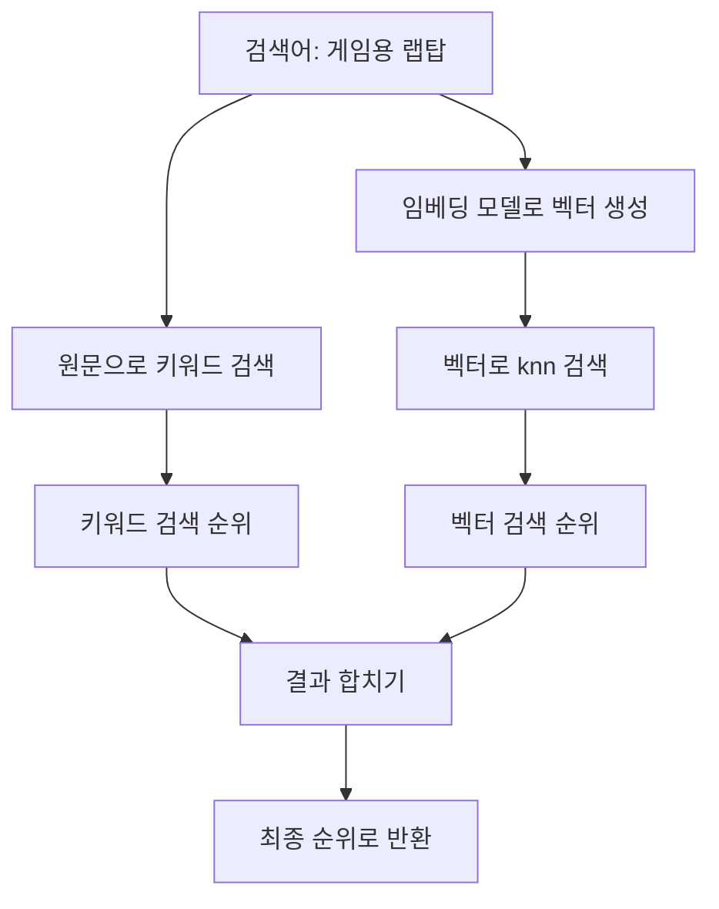

관련 개념: [[임베딩]], [[Elasticsearch 벡터 검색]].

하이브리드 검색 = ==**키워드 검색 결과 + 벡터 검색 결과를 합쳐 최종 순위를 만드는 방식**==.

- **키워드 검색**: 검색어에 사용된 단어를 잘 찾음. ex) 상품명·모델명.
- **벡터 검색**: 표현이 달라도 비슷한 의미를 찾음. ex) `"게임용 랩탑" → "게이밍 노트북"`.
- **하이브리드 검색**: 두 방식의 장점을 함께 사용.

## 1. 수행 과정: 각각 검색 → 결과 합치기

문서의 **원문과 임베딩 벡터가 미리 저장**되어 있다고 가정. [[Elasticsearch 벡터 검색#1. 문서를 벡터로 저장하기|벡터 저장 예제]]의 `title`, `embedding` 필드 사용.



1. **키워드 검색**: 검색어 원문을 `title`에서 검색 → BM25 점수로 순위 생성.
2. **벡터 검색**: 검색어를 임베딩 → `embedding`에서 가까운 벡터 검색 → 순위 생성.
3. **결과 결합**: 두 목록의 문서를 모음. 같은 문서는 하나로 합침.
4. **최종 반환**: 결합 점수로 정렬 → 필요한 개수만 반환.

==**키워드 검색 결과 안에서만 벡터 검색하는 순서가 아님**==. 여기서는 두 검색이 각각 후보를 찾고, 마지막에 합치는 구조.

>Microsoft의 검색 사례도 **키워드·벡터 검색 → 결과 결합 → 필요하면 추가 순위 조정(Reranking)** 흐름을 사용. [Microsoft — 하이브리드 검색과 재정렬](https://techcommunity.microsoft.com/blog/azure-ai-foundry-blog/azure-ai-search-outperforming-vector-search-with-hybrid-retrieval-and-reranking/3929167)

## 2. 결과를 어떻게 합칠까?

키워드 검색의 BM25 점수와 벡터 검색 점수는 **계산 기준과 범위가 다름**.
ex) `BM25 점수 12`와 `벡터 점수 0.9`를 그대로 더하면 숫자가 큰 쪽이 순위에 더 큰 영향을 줄 수 있음.

크게 ==**점수 기반 결합 / 순위 기반 결합**==으로 구분. 점수 기반은 ==**정규화 여부**==에 따라 다시 나뉨.

| 방식                 | 합치는 기준                  | 장점                  | 단점                             |
| ------------------ | ----------------------- | ------------------- | ------------------------------ |
| **원점수 가중 합산**      | 원래 점수에 가중치를 곱해 더함       | 구현 간단, 검색별 비중 조절 가능 | 점수 범위가 큰 검색이 순위를 지배하기 쉬움       |
| **정규화 + 가중 합산·CC** | 점수 범위를 맞춘 뒤(정규화) 가중 합산  | 점수 차이 보존, 비중 조절 가능  | 정규화·가중치 튜닝 필요                  |
| **RRF**            | 각 검색의 **순위를 점수로 바꿔 합산** | 원점수의 범위를 맞출 필요 없음   | 원래 점수 차이를 버림, 후보 수·순위 상수 튜닝 필요 |

### 점수 합산: 같은 문서가 받은 점수를 더하기

Elasticsearch 요청의 **최상위에 `query`와 `knn`을 함께 넣으면 원점수 가중 합산** 사용.

1. 키워드 검색 문서와 벡터 검색 상위 `k`개를 모음. 같은 문서는 한 번만 포함.
2. 문서별로 각 검색에서 받은 점수 합산 → 최종 순위 결정.
	- 최종 점수 = `(키워드 boost × 키워드 점수) + (벡터 boost × 벡터 점수)`
```text
boost를 생략하면 각각 1:1
A: 양쪽에서 검색됨 → 5 + 0.9 = 5.9
B: 키워드에서만 검색됨 → 3 + 0 = 3
C: 벡터에서만 검색됨 → 0 + 0.8 = 0.8
```

==**`query` + `knn`이 점수를 자동 정규화하는 것은 아님**==. `boost`는 가중치. RRF를 원하면 뒤의 `retriever.rrf` 방식으로 지정.

### CC: 가중치 합이 1인 점수 합산

**CC(Convex Combination)** = ==**음수가 아닌 가중치**==를 사용하고, ==**가중치의 합을 1로**== 맞추는 방식.
- 최종 점수 = `α × 키워드 점수 + (1 − α) × 벡터 점수` (0 ≤ α ≤ 1)
- ex) α = 0.7 → `키워드 점수 × 0.7 + 벡터 점수 × 0.3`

실무에서는 보통 ==**각 검색의 점수 정규화 → CC로 결합**==을 고려. 가중치를 0.7·0.3으로 설정해도 원점수 범위가 다르면 두 검색의 실제 영향이 7:3이 되는 것은 아님.

- **정규화**: 서로 다른 점수 범위를 비슷한 기준으로 맞추는 작업.
	- ex) **Min-Max 정규화**: 각 검색 목록의 최저 점수를 0, 최고 점수를 1로 변환. 중간 점수의 상대적 간격 유지.
- Elasticsearch의 **`linear` retriever**는 정규화와 가중 합산 지원. CC로 쓰려면 가중치 합을 1로 설정.

> Weaviate는 `relativeScoreFusion`을 기본 결합 방식으로 사용. 각 검색 점수를 Min-Max 정규화한 뒤 가중 합산. [Weaviate — 하이브리드 검색 사례](https://weaviate.io/blog/hybrid-search-explained)

### RRF: 각 검색의 순위를 점수로 바꿔 합치기

**RRF(Reciprocal Rank Fusion)** = ==**각 목록에서 높은 순위일수록 점수를 많이 부여**== → 문서별로 합산.
- 각 목록에서 받는 점수 = `1 / (rank_constant + 순위)`
- 최종 점수 = 각 목록에서 받은 점수의 합
ex) 두 검색 결과가 다음과 같다고 가정.

| 문서   | 키워드 검색 순위 | 벡터 검색 순위 |
| ---- | --------- | -------- |
| 상품 A | 1위        | 3위       |
| 상품 B | 2위        | 1위       |
| 상품 C | 3위        | 없음       |
| 상품 D | 없음        | 2위       |

```text
rank_constant = 60일 때:
상품 A = 1/61 + 1/63 ≈ 0.03227
상품 B = 1/62 + 1/61 ≈ 0.03252

최종 순위: B → A → D → C
```

- 목록에 없는 문서는 **그 목록에서 0점**.
- 같은 문서가 두 목록에 있으면 점수 합산. 결과에는 한 번만 표시.
- 한쪽 목록에만 있어도 최종 후보에 포함될 수 있음.
- ==**두 검색에서 모두 높은 순위를 얻은 문서가 유리해지는 구조**==.

## 3. Elasticsearch에서 RRF로 검색하기

**Elasticsearch 8.19 기준**. [[Elasticsearch 벡터 검색#1. 문서를 벡터로 저장하기|매핑·문서 저장 예제]]로 만든 `vector-products` 사용.
검색어 `"게임용 랩탑"`의 임베딩이 `[0.45, -0.23, 0.67]`이라고 가정.

==**retriever** = 검색 결과를 가져오는 설정==. 아래 요청에서 `standard`는 키워드 검색, `knn`은 벡터 검색, `rrf`는 두 결과 결합 역할.

```http
POST vector-products/_search
{
  "size": 5,
  "_source": ["title", "category"],
  "retriever": {
    "rrf": {
      "retrievers": [
        {
          "standard": {
            "query": {
              "match": { "title": "게임용 랩탑" }
            }
          }
        },
        {
          "knn": {
            "field": "embedding",
            "query_vector": [0.45, -0.23, 0.67],
            "k": 20,
            "num_candidates": 100
          }
        }
      ],
      "rank_window_size": 20,
      "rank_constant": 60
    }
  }
}
```

읽는 방법: **키워드·벡터 검색에서 각각 최대 20개 후보 → RRF로 결합 → 최종 5개 반환**. 저장된 문서가 적으면 그보다 적게 반환.

- `rank_window_size: 20`: ==**각 검색의 상위 몇 개를 결합할지**== 결정.
- `rank_constant: 60`: 순위별 점수 차이를 조절하는 값. ==**클수록 낮은 순위의 상대적 영향 증**==가.
	- 각 목록에서 받는 점수 = `1 / (rank_constant + 순위)`
- `size: 5`: 최종 응답 문서 수.

==**한 번의 Elasticsearch 요청 안에서 두 검색과 결과 결합을 처리**==. 애플리케이션은 검색어 임베딩을 먼저 생성해 요청에 넣음.

> [!note] 적용할 때 확인할 것
> - 카테고리·접근 권한처럼 검색 대상을 제한하는 조건은 **두 검색 모두에 적용**.
> - 후보에 들어오지 못한 문서는 RRF로 살릴 수 없음. 후보 수를 늘리면 검색 비용도 증가.
> - **내장 RRF의 사용 가능 여부는 배포 환경·라이선스 확인**. 지원하지 않으면 **애플리케이션에서 두 결과를 받아 RRF 계산** 가능.

## 4. 그럼 무엇부터 선택할까?

**추천 시작점**:

- **평가 데이터가 적거나 여러 검색 결과를 결합해야 함** → RRF부터 시작. 점수 범위를 맞추는 부담이 적음.
- **검색별 비중을 세밀하게 조절해야 하고 평가 데이터가 있음** → 정규화 + CC와 비교.
- **간단한 구현으로 시작해야 함** → 원점수 가중 합산 가능. 한쪽 점수가 순위를 지배하는지 확인.

==**평가 데이터 = 검색어와 그 검색어에 적합한 문서를 모아 둔 자료.**==
- 같은 자료로 **상위 결과 품질·응답 시간·비용** 비교 후 선택.
- RRF나 CC가 항상 더 좋다고 정할 수는 없음.

---
## 참고) 결합 이후 Reranking(재정렬)

- **재정렬(reranking)** = 가져온 후보를 다시 평가해 순서를 바꾸는 작업
- 하이브리드 검색 뒤에 **선택적으로 추가** 가능. 결과 결합과는 다른 단계.

```text
키워드 검색 + 벡터 검색 → RRF 또는 CC로 결합 → [선택: 재정렬] → 반환
```

| 방법                        | 평가 기준                       | 장점                            | 비용·한계                     |
| ------------------------- | --------------------------- | ----------------------------- | ------------------------- |
| **Reranking**             | 검색어와 후보 문서 내용을 함께 읽고 관련성 평가 | ==**내용의 관련성**==을 더 정밀하게 판단 가능 | ==**모델 실행 비용·응답 시간 증가**== |
| **LTR(Learning to Rank)** | 검색 점수·최신성·인기도 등 여러 특징을 학습   | ==**서비스 목적에 맞는 순위 조정**==      | 학습 데이터·특징 관리·재학습 필요       |

- **문서 내용의 관련성을 더 정밀하게 판단**하려면 → Reranking
- **여러 서비스 지표를 함께 반영**하려면 → LTR 검토
- 둘 다 이미 가져온 후보의 순서를 바꾸므로 ==**후보에 없는 문서를 새로 찾지는 못함**==.

---

> [!quote] 출처
> - [Elastic — 키워드 + kNN 결합](https://www.elastic.co/guide/en/elasticsearch/reference/8.19/knn-search.html#_combine_approximate_knn_with_other_features)
> - [Elastic — RRF 계산 방식](https://www.elastic.co/guide/en/elasticsearch/reference/8.19/rrf.html)
> - [Elastic — RRF retriever](https://www.elastic.co/guide/en/elasticsearch/reference/8.19/retriever.html#rrf-retriever)
> - [Elastic — 구독별 기능](https://www.elastic.co/subscriptions)
> - [Elastic — 정규화·가중 합산을 지원하는 linear retriever](https://www.elastic.co/guide/en/elasticsearch/reference/8.19/retriever.html#linear-retriever)
> - [Elastic — CC와 점수 정규화](https://www.elastic.co/search-labs/blog/hybrid-search-elasticsearch)
> - [Elastic — Learning to Rank](https://www.elastic.co/guide/en/elasticsearch/reference/8.19/learning-to-rank.html)
> - [Microsoft — 결합과 모델 재정렬의 차이](https://techcommunity.microsoft.com/blog/azure-ai-foundry-blog/azure-ai-search-outperforming-vector-search-with-hybrid-retrieval-and-reranking/3929167)
