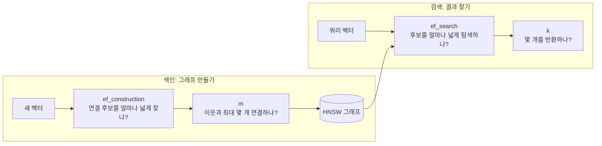

# HNSW 핵심

**HNSW(Hierarchical Navigable Small World)** = 벡터를 가까운 이웃과 연결한 **다층 그래프 기반 근사 최근접 이웃(ANN) 인덱스**. 모든 벡터를 비교하지 않고 연결을 따라 가까운 후보를 찾는다. 

- 장점: 검색이 빠르고 재현율을 높이기 좋음
- 단점: 정확한 최근접 이웃을 항상 보장하지는 않음

>kNN·ANN 전체 흐름은 [[Elasticsearch 벡터 검색#KNN(K-Nearest Neighbors) 검색|벡터 검색 노트]] 참고.

- HNSW가 빠른 이유?
	- 위층에는 적은 노드와 긴 연결이 있어 먼 곳으로 빠르게 이동한다. 아래층으로 내려갈수록 더 많은 노드의 가까운 이웃을 살핀다. 
	- => **후보만 비교**하므로 전체 벡터를 훑는 정확 kNN보다 검색량을 줄일 수 있다. 대신 탐색 경로 밖의 진짜 이웃을 놓칠 수 있다.
- 무엇을 저장하는가? = **벡터 값 + 그래프 연결 정보**
	- **벡터 값** = [[임베딩]]을 이루는 숫자들. ex) `[0.2, -0.1, 0.7]`은 3차원 벡터. 검색할 때 쿼리 벡터와 이 숫자들의 거리를 계산한다.
	- **OpenSearch 엔진** = HNSW를 실제로 구현한 라이브러리. 같은 HNSW라도 저장·메모리 사용·지원 설정이 다름. 아래 Lucene·Faiss 비교는 OpenSearch 기준.
		- **Lucene**: 세그먼트별 파일을 메모리 매핑(`mmap`)으로 읽음. 접근한 부분이 ==OS **페이지 캐시**==에 올라감. ==**캐시 부족 → 디스크 재읽기 → 검색 지연 증가**==.
		- **Faiss의 일반 메모리 모드**: 그래프를 ==**JVM 힙 밖의 자체 메모리 캐시**==에 올려 검색.
		- 둘 다 JVM 힙 사용량만으로 전체 메모리 여유를 판단할 수 없음.
	- `float32` 벡터 자체의 크기는 대략 **벡터 수 × 차원 수 × 4바이트**. 여기에 그래프 연결, 메타데이터, 세그먼트, 복제본 비용이 더해짐. ex) 1,024차원 벡터 100만 개 → 벡터 값만 약 **4.1GB**.

---
## OpenSearch 구현·튜닝·자원 비용

위 그림은 개념도. 각 값이 바꾸는 대상과 비용은 다르다.

- **파라미터 튜닝**
	- 색인 쪽 <- 변경 시 재색인 필요
		- **`m` **: 노드당 최대 연결 수(= 그래프 연결 수, 그래프 크기)
			- 효과: 늘리면 탐색 경로가 다양해져 재현율 개선 가능
			- 대가: **그래프의 디스크 크기·RAM 사용·색인 시간 증가**. 
		- **`ef_construction`**: 색인 시 후보 범위. 
			- 효과: 늘리면 새 벡터를 연결할 이웃을 더 넓게 찾음 -> 그래프 품질 개선 가능.
			- 대가: **색인 시간 증가**
			- 검색 시 후보 수나 벡터 크기를 직접 바꾸지는 않음. 
	- 검색 쪽
		- **`ef_search`**: 검색 후보 크기 (Elasticsearch에서는 `num_candidates`)
			- 효과: 늘리면 재현율 개선 가능. 
			- 대가: **검색 시간 증가**. 
			- **Faiss는 `ef_search`로 탐색 폭 조절. Lucene은 인덱스의 `ef_search` 설정을 무시하고 `k`를 사용하지만, 쿼리에서 `k`보다 큰 `ef_search`를 지정하면 그 값을 사용.**
		- **`k`**: 후보로부터 결과로 반환할 벡터 개수
			- 효과: 늘리면 요청하는 이웃 수가 늘어남. `k`가 바뀌면 Recall@k의 기준도 바뀌므로, 재현율 개선 여부는 `k`를 고정하고 탐색 범위를 바꿔 비교해야 함.
			- 대가: **검색 비용 증가**.
			- 결과 수를 유지하고 탐색만 넓히려면 `ef_search`와 최종 응답 수(`size`)를 함께 설정. 엔진별 동작은 위 설명 참고.
- **양자화**: 벡터 숫자 압축
	- 효과: 낮은 정밀도로 저장해 ==**검색용 벡터의 디스크 크기·RAM 부담 감소**==. 
	- 대가 근사 거리의 오차가 커져 재현율 저하 가능. 
	- 원본 벡터를 재점수화용으로 보관하면 전체 디스크 크기는 압축 배율만큼 줄지 않음. 그래프 연결 크기도 그대로. 
	- 지원 방식·압축 수준은 엔진별로 다름.

>- **압축 인덱스** = 양자화한 검색용 벡터와 이를 탐색할 HNSW 그래프. 압축되는 핵심은 벡터 값이며, 그래프 연결은 별도로 남는다.
> 
> **재점수화는 검색할 때, 후보 탐색 후·최종 `k`개 반환 전에 실행한다.**
> 1. 양자화 벡터와 HNSW 그래프로 후보를 찾는다.
> 2. 재점수화가 켜져 있으면 **그 후보만** 원본 벡터로 다시 비교·정렬한다.
> 3. 상위 `k`개를 반환한다. 후보에 들지 못한 문서는 되찾지 못한다.
>
> OpenSearch는 기본 `on_disk` 설정에서 재점수화가 자동 적용된다. `in_memory`에서는 기본 적용되지 않으며, 양자화 인덱스의 검색 요청에서 명시적으로 켤 수 있다.

- **`on_disk`: 디스크 중심 검색 모드**. OpenSearch 기본 설정은 압축 인덱스로 후보를 찾고 필요할 때 원본 벡터를 디스크에서 읽어 재점수화. 
	- 효과: **RAM 부담 감소**가 목적이며 양자화와 함께 쓰임. 
	- 대가: 디스크 읽기·검색 지연 증가 가능. 
	- 디스크 총용량 절감을 뜻하지 않음. 
	- 기본 엔진은 Faiss HNSW. 일부 압축 수준은 Lucene 사용.
- **벡터 수·차원**: = 입력 데이터 규모. 
	- 효과: 줄이면 벡터와 그래프의 저장·RAM 비용 감소. 
	- 대가: 검색 대상이 빠지거나 임베딩 정보가 줄어 품질 저하 가능. 
	- 차원 변경은 모델·전체 인덱스 재설계가 필요하며 HNSW 고유 설정은 아님.

> [!quote] 출처
> - [HNSW 원 논문 — 다층 그래프와 탐색](https://arxiv.org/abs/1603.09320)
> - [OpenSearch — 엔진별 HNSW 설정](https://docs.opensearch.org/latest/mappings/supported-field-types/knn-methods-engines/)
> - [OpenSearch — kNN 쿼리별 `ef_search`·`size`](https://docs.opensearch.org/latest/query-dsl/specialized/k-nn/index/)
> - [OpenSearch — Lucene의 메모리 매핑과 페이지 캐시](https://opensearch.org/blog/lucene-hnsw-performance-a-deep-dive-into-the-os-page-cache/)
> - [OpenSearch — 디스크 검색과 압축](https://docs.opensearch.org/latest/vector-search/optimizing-storage/disk-based-vector-search/)
> - [OpenSearch — 엔진별 압축 수준](https://docs.opensearch.org/latest/mappings/supported-field-types/knn-memory-optimized/)
> - [Meta Engineering — 속도·메모리·재현율 평가](https://engineering.fb.com/2017/03/29/data-infrastructure/faiss-a-library-for-efficient-similarity-search/)
